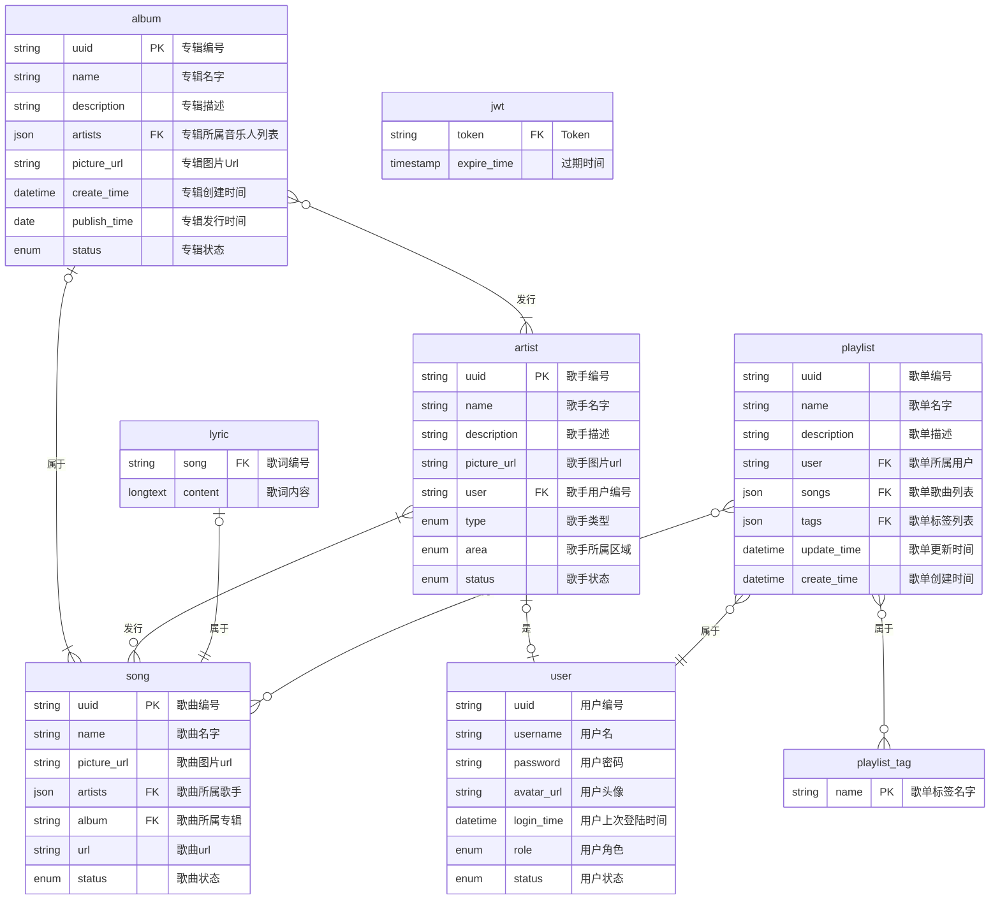

# 音乐网站

## 技术栈

- Mysql
- Java (AOP + OOP)
- Servlet
- html + css + js

## 缺陷

- 权限验证

<!-- TODO: 权限验证 -->

## 接口

<!-- 尽量使用前后端分离的模式 -->

- 通用
  - 登陆`/login`, `POST`:
  - 登出`/logout`, `POST`:
- 前台`/home`

  - 无权限

    - 获取专辑列表`/albums` `GET`: 可搜索，分页

      | 请求参数 | 描述     |
      | -------- | -------- |
      | search   | 搜索参数 |
      | page     | 页码     |
      | size     | 每页数量 |

    - 获取专辑详情`/album` `GET`:
    - 获取艺人列表`/artists` `GET`: 可搜索，分页
    - 获取歌单列表`/playlists` `GET`: 可搜索，分页
    - 获取歌曲列表`/songs` `GET`: 可搜索，分页
    - 获取用户列表`/users` `GET`: 可搜索，分页
    - 获取歌单标签列表`/song/tags` `GET`: 可搜索，分页

  - 普通用户
    - 获取个人信息`/user/info` `GET`：
      <!-- - 修改个人信息： -->
      <!-- - 获取自己的歌单: 可搜索，分页 -->
  - 歌手
    <!-- - 获取发行专辑`/`: 可搜索，分页 -->
    <!-- - 获取发行歌曲: 可搜索，分页 -->
    - 添加歌曲`/song` `POST`
    - 添加专辑`/album` `POST`

- 后台
  - 获取所有用户列表`/users`: 可搜索，分页
  - 修改用户信息`/user` `PATCH`
  - 添加歌单标签列表`/song/tags` `POST`

## 数据库

## 详细设计

查询所有辑

select uuid, name, description, artists, picture_url as pictureUrl, publish_time as publishTime, create_time as createTime, status from album

查询所有歌手
select uuid, name, description, picture_url as pictureUrl, user, type, area, status from artist

查询所有歌词
select song, content from lyric

查询所有的歌单
select uuid, name, description, picture_url as pictureUrl, user, songs, tags, update_time as updateTime, create_time as createTime from playlist

查询所有歌单标签
select `name` from playlist_tag

查询所有歌曲
select uuid, name, picture_url as pictureUrl, artists, album, url, status from song

查询所有的用户
select uuid, username, password, nickname , avatar_url as avatarUrl, login_time as loginTime, role, status from user

查询所有用户登陆的 Token
select token, expire_time as expireTime from jwt

根据歌单编号查询所有歌曲
select uuid, name, picture_url as pictureUrl, artists, album, url, status from song where uuid in ( SELECT distinct song.uuid FROM playlist, JSON_TABLE( playlist.songs,'$[*]' COLUMNS( uuid varchar(36) PATH '$' ) ) song where playlist.uuid = ? );

分页查询：
在查询后边加 limit ?,?

插入语句
使用该函数动态生成
public static boolean insertEntity(String tableName, Map<String, Object> fieldMap);

更新语句
public static boolean updateEntity(String tableName, Map.Entry<String, Object> id, Map<String, Object> fieldMap)
public static boolean updateBatch(String tableName, Map.Entry<String, Object[]> ids, Map<String, Object> fieldMap)

删除语句
使用该函数动态生成
public static boolean deleteEntity(String tableName, Map.Entry<String, Object> id);

### 实体

| 实体         | 描述     |
| ------------ | -------- |
| album        | 专辑     |
| artist       | 歌手     |
| lyric        | 歌词     |
| playlist     | 歌单     |
| playlist_tag | 歌单标签 |
| song         | 歌曲     |
| user         | 用户     |

```text
歌手标签
type 取值:
-1:全部
1:男歌手
2:女歌手
3:乐队

area 取值:
-1:全部
7华语
96欧美
8:日
16韩国t
```

### ER 图



[^1]
[^1]: 歌曲数据来源: [github:Binaryify/NeteaseCloudMusicApi](https://github.com/Binaryify/NeteaseCloudMusicApi)
